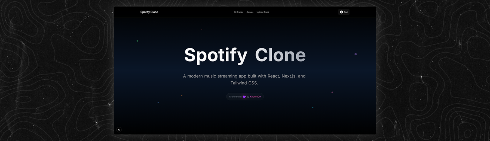

# 🎵 Spotify Clone - Full Stack Application

## Showcase



<div align="center">

### Built With


</div>

---

## 🚀 Quick Start

### Prerequisites
- **.NET 8.0 SDK** or higher
- **Node.js 18+** and npm
- **PowerShell** (for Windows)

---

## 📦 Installation

### 1️⃣ Backend Setup (C# .NET)

```powershell
# Navigate to backend directory
cd backend/spotifyClone

# Restore dependencies
dotnet restore

# Run the backend server
dotnet run
```

✅ Backend will run on **http://localhost:5001**

---

### 2️⃣ Frontend Setup (Next.js + React)

```powershell
# Navigate to frontend directory
cd frontend

# Install all dependencies (Next.js, React, GSAP, Tailwind CSS, TypeScript)
npm install

# Run the development server
npm run dev
```

**Dependencies installed:**
- `next@15.5.4` - Next.js framework with Turbopack
- `react@19.1.0` & `react-dom@19.1.0` - React library
- `gsap@3.13.0` - Animation library
- `tailwindcss@4` & `@tailwindcss/postcss@4` - CSS framework
- `typescript@5` - TypeScript support
- ESLint for code quality

✅ Frontend will run on **http://localhost:3001**

---

## 🎯 Features

- ✅ **User Authentication** (Register & Login with JWT)
- ✅ **User Profile Menu** with logout functionality
- ✅ **GSAP Animations** (smooth navbar, dropdowns, title effects)
- ✅ **Modern UI** with Tailwind CSS v4
- ✅ **SQLite Database** with Entity Framework Core
- ✅ **CORS Enabled** for frontend-backend communication
- ✅ **TypeScript** support
- ✅ **Password Hashing** with BCrypt

---

## 🛠️ Tech Stack

### Backend
- **C# .NET 8.0**
- **Entity Framework Core** (SQLite)
- **JWT Authentication**
- **BCrypt** for password hashing
- **ASP.NET Core Web API**

### Frontend
- **Next.js 15.5.4** with Turbopack
- **React 19.1.0**
- **TypeScript**
- **Tailwind CSS v4**
- **GSAP** (GreenSock Animation Platform)

---

## 📝 Usage

1. **Start Backend**: Run `dotnet run` in `backend/spotifyClone`
2. **Start Frontend**: Run `npm run dev` in `frontend`
3. **Open Browser**: Navigate to `http://localhost:3001`
4. **Register**: Click "Sign up" and create an account
5. **Login**: Enter your credentials
6. **Enjoy**: Your user icon will appear in the navbar!

---

## 🔑 API Endpoints

### Authentication
- `POST /api/auth/register` - Register new user
- `POST /api/auth/login` - Login user

### Tracks
- `GET /api/track` - Get all tracks
- `GET /api/track/{id}` - Get track by ID
- `POST /api/track` - Create new track
- `PUT /api/track/{id}` - Update track
- `DELETE /api/track/{id}` - Delete track

### Artists
- `GET /api/artist` - Get all artists
- `GET /api/artist/{id}` - Get artist by ID

### Genres
- `GET /api/genre` - Get all genres

---

## 📂 Project Structure

```
spr421_spotify_clone_api_react/
├── backend/
│   ├── spotifyClone/          # Main API project
│   │   ├── Controllers/       # API controllers
│   │   ├── Services/          # Business logic
│   │   ├── DTOs/             # Data transfer objects
│   │   └── Program.cs        # Entry point with CORS
│   ├── spotifyClone.DAL/     # Data Access Layer
│   │   ├── Entities/         # Database models
│   │   ├── Repositories/     # Data repositories
│   │   └── Migrations/       # EF Core migrations
│   └── spotifyClone.BLL/     # Business Logic Layer
└── frontend/
    ├── src/
    │   ├── app/              # Next.js pages
    │   └── components/       # React components
    │       ├── Navbar.tsx    # Main navigation
    │       └── auth/         # Login & Signup forms
    ├── package.json
    └── next.config.ts
```

---

## 🎨 Features Showcase

### Navbar with GSAP Animations
- Smooth slide-down entrance
- Staggered button animations
- Dropdown forms with scale effects

### User Authentication
- Registration with validation
- JWT-based login
- User profile display
- Secure logout

### Modern Design
- Glass-morphism effects
- Smooth transitions
- Responsive layout
- Professional color scheme

---

## 📚 Documentation

- **[POSTMAN Testing Guide](backend/POSTMAN_TESTING_GUIDE.md)** - API testing instructions
- **[User Auth Complete](USER_AUTH_COMPLETE.md)** - Authentication implementation details
- **[API Test Guide](API_TEST_GUIDE.md)** - Endpoint testing reference

---

## 👨‍🏫 For Teachers

### Quick Test Run:
```powershell
# Terminal 1 - Backend
cd backend/spotifyClone
dotnet run

# Terminal 2 - Frontend
cd frontend
npm install
npm run dev
```

Then open **http://localhost:3001** in your browser!

---

## 📄 License

This project is for educational purposes.

---

## 🙏 Credits

Built with ❤️ using modern web technologies
